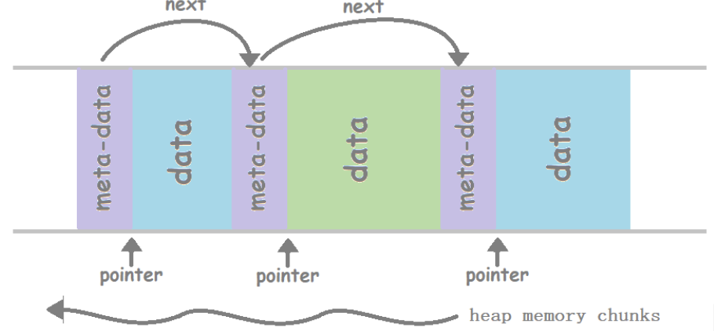

# Memory Allocator

A simple yet powerful dynamic memory management system that mimics the behavior of `malloc`, `free`, `calloc`, and `realloc`, tailored for both **small** and **large** memory allocations.



---

##  Features

- Custom `malloc`, `free`, `calloc`, `realloc` functions using data structures
-  Memory coalescing to reduce fragmentation
-  Block splitting for efficient space use
- Separate strategies for small & large allocations

---

## Usage

Include the header and link the implementation file:

```c
#include "osmem.h"
```

Then use the custom allocation functions just like standard ones:

```c
void *ptr = os_malloc(64);
os_free(ptr);
```

---

## Functions

### `void *os_malloc(size_t size)`
> Allocates a block of memory of the specified size.  
Uses internal data structures to track and deliver usable payloads.

---

### `void os_free(void *ptr)`
> Frees the memory block pointed to by `ptr`.  
Handles both `sbrk`-based and `mmap`-based memory allocations.

---

### `void *os_calloc(size_t nmemb, size_t size)`
> Allocates memory for an array and **initializes it to zero**.  
Perfect for ensuring clean, zeroed memory.

---

### `void *os_realloc(void *ptr, size_t size)`
> Resizes a previously allocated block.  
Handles all edge cases like expansion, shrinking, or creating new blocks.

---

## Memory Allocation Strategies

### Small Allocations (`< CHUNK size`)
- Uses `sbrk` syscall for linear heap expansion.
- Preallocates a chunk on first use.
- Finds suitable free blocks or expands the heap.

### Large Allocations (`>= CHUNK size`)
- Uses `mmap` syscall for direct mapping of large memory blocks.

---

## Optimizations

### Memory Coalescing
> Adjacent free blocks are **merged** to prevent fragmentation.

###  Block Splitting
> Large blocks are **split** into smaller parts when possible.

---

## 📁 File Structure

```
├── osmem.h         # Header file with function declarations
├── osmem.c         # Implementation of the memory allocator
└── README.md       # You are here!
```


